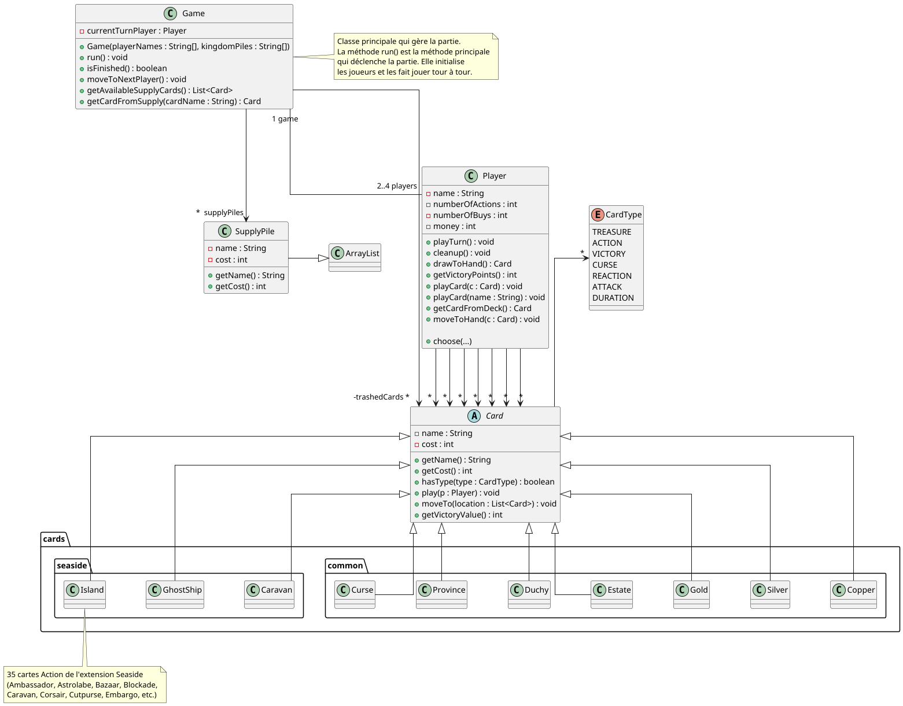

# 

# Projet (SAE) - _DOMINION SEASIDE_

### IUT Montpellier-Sète – Département Informatique

Ce projet a lieu dans le cadre des Situations d'Apprentissage et Évaluation du BUT Informatique (SAE S2.01). Il fera intervenir plusieurs compétences acquises durant le Semestre 2 : le développement orienté objets, les notions de qualité de développement (tests unitaires, gestion de version, _etc._), les interfaces homme-machine.

## Calendrier de travail

Le projet a été conçu pour être réalisé de façon incrémentale en 2 phases :

-   **Phase 1 : _développement de la mécanique du jeu en Java_**

    -   **Période :** 23 mars — 17 avril 2026
    -   **Cours concerné** : [_Développement Orienté Objets_](https://gitlabinfo.iutmontp.univ-montp2.fr/dev-objets)
    -   **Enseignants :**
        [Malo Gasquet](mailto:malo.gasquet@umontpellier.fr),
        [Sophie Nabitz](mailto:sophie.nabitz@univ-avignon.fr),
        [Cyrille Nadal](mailto:cyrille.nadal@umontpellier.fr),
        [Victor Poupet](mailto:victor.poupet@umontpellier.fr),
        [Marin Bougeret](mailto:marin.bougeret@umontpellier.fr),
        [Petru Valicov](mailto:petru.valicov@umontpellier.fr)
    -   [forum Piazza](https://piazza.com/umontpellier.fr/spring2026/devobjets/) de ce cours pour poser vos questions
    -   **Modalités de notation de la Phase 1** :
        -   tests unitaires automatisés **secrets**
        -   individualisation des notes en fonction des contributions de chaque membre de l'équipe

    Les deux phases du projet sont relativement indépendantes. Les détails concernant la Phase 2 seront communiqués ultérieurement.

-   **Phase 2 : _implémentation d'une interface graphique sous [JavaFX](https://openjfx.io/)_**
    -   **Période (prévisionnelle) :** mi-mai — juin 2026
    -   **Cours concerné** : _[Développement d’applications avec IHM](https://gitlabinfo.iutmontp.univ-montp2.fr/ihm)_
    -   **Enseignants :**
        [Sophie Nabitz](mailto:sophie.nabitz@univ-avignon.fr),
        [Cyrille Nadal](mailto:cyrille.nadal@umontpellier.fr),
        [Nathalie Palleja](mailto:nathalie.palleja@umontpellier.fr),
        [Imen Ben Sassi](mailto:imen.ben-sassi@umontpellier.fr),
        [Petru Valicov](mailto:petru.valicov@umontpellier.fr),
    -   **Modalités de notation de la Phase 2** : À définir ultérieurement

## Notation de la SAE 2.1

-   **SAE 2.1 :** note de la Phase 1 : 50%, note de la Phase 2 : 50%

## Présentation
Le but de ce projet est de produire une implémentation en _Java_ du jeu de cartes [_Dominion Seaside_](https://wiki.dominionstrategy.com/index.php/Seaside).

_Dominion_ est un jeu de cartes inventé par Donald X. Vaccarino pour 2 à 4 joueurs. C'est un jeu de _construction de deck_ où les joueurs doivent à tour de rôle jouer des cartes de leur main pour obtenir de nouvelles cartes parmi un ensemble commun disponible. Lorsque la partie s'arrête, le joueur possédant le plus de points de victoire dans son deck est déclaré vainqueur.

Le fichier [règles de base](https://wiki.dominionstrategy.com/images/0/00/DominionRulebook2021.pdf) contient les règles principales du jeu. Dans ce projet, nous considérerons l'extension [_Seaside_](https://wiki.dominionstrategy.com/images/2/2f/SeasideRulebook2022.pdf) du jeu, qui introduit notamment les cartes _Duration_ dont les effets persistent au-delà du tour où elles sont jouées.

Vous devez donc commencer par :
- lire [les règles du jeu de base](https://wiki.dominionstrategy.com/images/0/00/DominionRulebook2021.pdf) pour comprendre les mécanismes généraux du jeu. Vous pouvez ignorer les détails qui sont spécifiques aux cartes du jeu de base, que vous n'aurez pas à implémenter (à partir de la section _Kingdom Card Notes_ page 12)
- lire [les règles spécifiques de l'extension Seaside](https://wiki.dominionstrategy.com/images/2/2f/SeasideRulebook2022.pdf) qui présentent les nouvelles mécaniques de jeu, ainsi que des descriptions des cartes de l'extension (que vous allez devoir implémenter)

Il existe également un [Wiki](https://wiki.dominionstrategy.com/index.php/Seaside) très complet concernant tous les aspects du jeu que vous êtes encouragés à consulter tout au long du développement du projet. Il contient en particulier une page spécifique pour chacune des cartes avec des explications supplémentaires.

**Important** : Dans ce projet il vous est uniquement demandé d'écrire les cartes _Kingdom_ de l'extension _Seaside_ (ainsi que les cartes communes _Trésor_, _Victoire_ et _Malédiction_). Les cartes _Kingdom_ du jeu de base ne sont pas à implémenter.

## Consignes générales

Un squelette du code vous est fourni et vous devrez :

-   écrire le corps des fonctions non implémentées qui vous sont fournies
-   ajouter des fonctions/attributs/classes là où cela vous semble utile
-   vérifier que votre programme marche en faisant des tests unitaires
-   sauf indication explicite de la part des enseignants, ne pas modifier la signature des attributs et méthodes qui vous sont données

Le fichier [IO.md](https://gitlabinfo.iutmontp.univ-montp2.fr/dev-objets/projets/dominion-seaside/IO.md) contient des précisions sur les entrées/sorties attendues avec des exemples et des détails pour chacune des cartes à écrire :

-   les entrées attendues de la part de l'utilisateur dans différents scénarios
-   les résultats attendus de la part du programme

Pensez à consulter régulièrement les [FAQ](https://gitlabinfo.iutmontp.univ-montp2.fr/dev-objets/projets/dominion-seaside/FAQ.md). Vous serez informés s'il y a des nouveautés (surveillez le [Forum Piazza](https://piazza.com/umontpellier.fr/spring2026/devobjets/)).

_**Le non-respect des consignes aura de fortes implications sur la note finale.**_

## Architecture générale du code

Le projet est structuré en 3 paquetages : `fr.umontpellier.iut.dominion`, `fr.umontpellier.iut.dominion.cards`, `fr.umontpellier.iut.dominion.gui`. Les classes du paquetage `fr.umontpellier.iut.dominion.gui` servent uniquement à l'interface graphique et, sauf indication contraire, vous n'aurez pas à les modifier.

Les 2 autres paquetages `fr.umontpellier.iut.dominion` et `fr.umontpellier.iut.dominion.cards`, représentent le code métier du projet. Voici son diagramme de classes **simplifié** :

Dans le diagramme ci-dessus, sont représentés seulement les méthodes et attributs contribuant à la compréhension de la modélisation orientée objet du jeu. Beaucoup de méthodes, attributs, classes et relations entre classes, ont été omis pour des raisons de clarté.

**Important :** Sauf indication contraire, les déclarations des attributs et les signatures des méthodes qui vous sont données doivent rester intactes. Vous pouvez cependant ajouter des méthodes, des attributs et des classes supplémentaires si vous le jugez nécessaire.

### Les cartes

Toutes les cartes du jeu sont caractérisées par  
* un nom (en haut) ;
* un prix d'achat (en bas à gauche) ;
* un type (en bas) qui est une combinaison des types de base _Treasure_, _Victory_, _Curse_, _Action_, _Attack_, _Reaction_ ou _Duration_. Par exemple : _Treasure_, _Action/Duration_, _Action/Duration/Reaction_, _Treasure/Duration_, etc. ;
* une description (centre) qui correspond à l'effet de la carte lorsqu'elle est jouée (_Action_ ou _Treasure_) ou comptabilisée en fin de partie (_Victory_).

Par ailleurs, l'ensemble des cartes utilisées est déterminé en début de partie et à tout moment de la partie, chaque carte est
* soit dans une des piles de la _réserve_ (_supply_), commune à tous les joueurs ;
* soit dans la pile de cartes _écartées_ (_trash_) ;
* soit dans une des piles en la possession d'un joueur (main, défausse, etc.).

#### La classe `Card` et ses sous-classes

Les cartes du jeu sont représentées par des objets de la classe `Card`. Pour chacune des cartes "physiques" (de la boîte du jeu _Dominion_) on associe une instance de `Card` correspondante. Ainsi, au démarrage de la partie, tous les objets `Card` sont créés et conservés durant toute la partie. Il n'y a donc pas de _création_ (ni _destruction_) de nouvelles cartes après le démarrage de la partie.

On définit une sous-classe de `Card` pour chacun des types de carte possibles du jeu. Toutes les classes de cartes sont présentes dans le dépôt et vous devez toutes les programmer.

**Important** : votre code devra respecter la sémantique de cette architecture logicielle, mais au besoin, vous pouvez ajouter d'autres classes à ce diagramme.

#### Les types de cartes

Pour représenter correctement les différents types possibles des cartes, un [type énuméré](https://docs.oracle.com/javase/tutorial/java/javaOO/enum.html) `CardType` est fourni. Il contient les constantes  
* `Treasure`
* `Action`
* `Victory`
* `Curse`
* `Reaction`
* `Attack`
* `Duration`

La méthode `hasType(CardType)` de la classe `Card` permet de tester si une carte possède un type donné. Remarquez que les cartes du jeu peuvent avoir un ou plusieurs types (par exemple _Action/Duration_ ou _Action/Attack_).

### Les joueurs

Les joueurs de la partie sont identifiés par un nom (de type `String`). À tout moment de la partie, les cartes que possède un joueur peuvent être dans l'un des 7 emplacements suivants :

* sa _main_ (`hand`) ;
* sa _défausse_ (`discard`) ;
* sa _pioche_ (`draw`) ;
* ses cartes _en jeu_ (`inPlay`) ;
* les cartes mises de côté (`cardsSetAside`) ;
* les cartes sur le tapis correspondant à la carte _Island_ (`islandMat`) ;
* les cartes sur le tapis correspondant à la carte _Native Village_ (`nativeVillageMat`) ;

Chaque joueur commence la partie avec 3 cartes _Estate_ et 7 cartes _Copper_ toutes mélangées et cachées dans sa défausse. Ensuite, il pioche immédiatement en main 5 cartes de cette défausse de manière arbitraire.

En plus de ses cartes, un joueur a différents compteurs de ressources :

* le nombre de pièces dont il dispose pour acheter des cartes, initialisé à 0 au début de son tour (`money`) ;
* le nombre d'_actions_ qu'il peut jouer, initialisé à 1 au début de son tour (`numberOfActions`) ;
* le nombre d'achats qu'il peut réaliser, initialisé à 1 au début de son tour (`numberOfBuys`) ;

#### La classe `Player`

Les joueurs participant à une partie de _Dominion_ sont représentés par des instances d'une classe `Player`. Le nom, les compteurs (actions, argent, achats), les différentes piles de cartes du joueur ainsi que la partie dans laquelle il se trouve sont représentés par des attributs de cette classe.

### Déroulement du tour

Le tour d'un joueur s'exécute en plusieurs étapes

  **Préparation.** Les compteurs du joueur sont remis aux valeurs indiquées par les règles : 1 pour les actions et les achats, et 0 pour l'argent.
  
  **Action.** Le joueur peut jouer des cartes _Action_ de sa main tant que son compteur d'actions est supérieur ou égal à 1. Lorsqu'une carte _Action_ est jouée, le compteur d'actions du joueur est décrémenté de 1, la carte jouée est marquée comme étant _en jeu_ et l'action de la carte est exécutée. Le joueur peut choisir de passer à la phase suivante même s'il lui reste des actions qu'il peut jouer.

  **Trésors.** Le joueur peut jouer des cartes _Trésor_ de sa main. Dans le jeu de base, il n'y a aucune situation où le joueur aurait un intérêt à conserver des trésors dans sa main. On pourra donc considérer ici que le joueur joue automatiquement tous les trésors qu'il a en main.

  **Achats.** Le joueur peut acheter des cartes de la réserve en utilisant l'argent qu'il a amassé pendant les phases précédentes. Le joueur peut acheter une carte s'il lui reste au moins un achat et que le prix de la carte est inférieur à la somme dont il dispose. Lorsqu'il achète une carte, son compteur d'achats est décrémenté de 1, son argent est décrémenté de la valeur de la carte achetée et la carte achetée est déplacée dans la défausse du joueur. Le joueur peut choisir de terminer cette phase même s'il peut encore acheter des cartes.

  **Fin.** À la fin du tour, toutes les cartes (de la main du joueur et en jeu) sont défaussées, les compteurs du joueur sont remis à 0 et le joueur pioche 5 nouvelles cartes en main. Il est important que les cartes soient piochées à la fin du tour, car la main peut être affectée pendant le tour d'un autre joueur (cf. _Ghost Ship_ ou _Cutpurse_ par exemple). Les cartes _Duration_ restent en jeu jusqu'au début du tour suivant, où leur effet différé est appliqué.

### La partie

Une partie de _Dominion_ est représentée par une instance de la classe `Game`. C'est la partie qui gère la liste des joueurs et l'ensemble des cartes communes. Cette classe contrôle également le déroulement de la partie : mise en place, alternance des tours des joueurs et fin de partie lorsque les conditions de fin sont remplies.

Pour démarrer une partie, il faut spécifier le nombre de joueurs qui y participent ainsi que la liste des cartes à utiliser comme piles de réserve. Le code du constructeur de la classe `Game` vous est entièrement fourni (vous n'avez pas à le modifier). Il prend deux arguments en paramètres :

  **`String[] playerNames`**: la liste des noms des joueurs qui participent à la partie (c'est le constructeur de `Game` qui construit les instances de `Player` correspondantes)  
  **`String[] kingdomPiles`**: les noms des cartes _Royaume_ à utiliser pour la partie. Les règles du jeu prévoient 10 piles _Royaume_, mais la partie peut fonctionner avec un nombre différent. Le constructeur de `Game` ajoute automatiquement à ces piles les piles de réserve communes (cartes _Trésor_, _Victoire_ et _Malédiction_)

### Interface graphique (web)

Pour rendre l'expérience ludique, et pour que votre jeu ressemble à un _vrai_ jeu, une interface graphique vous est également fournie. Cette interface interprète la saisie console et affiche le jeu de manière plus proche d'un utilisateur non-informaticien dans un navigateur web. Vous n'aurez pas à la modifier (ni à adapter votre code), cette partie étant complètement indépendante de votre projet. Nous vous conseillons d'utiliser l'interface graphique directement pour simuler votre jeu, car utiliser uniquement la console peut s'avérer particulièrement pénible.

Voici un aperçu de l'interface graphique du jeu, au milieu d'une partie :

**Important** : Des méthodes spéciales `log()`, `readLine()`, `prompt()`, `toLog()`, `toJSON()` et `sendToUI()` ont été ajoutées aux classes. Également les définitions des méthodes `toString()` de différentes classes de l'application sont données. Toutes ces méthodes sont nécessaires pour l'IHM. **Vous ne devriez pas les modifier !**

À tout moment vous pouvez faire un appel à la fonction `log(String)` des classes `Game` ou `Player` pour afficher des messages sur l'interface (dans le cadre à droite de l'écran). N'hésitez pas à l'appeler et lui passer le message correspondant afin de visualiser les actions de l'utilisateur.

### Interface console

Une interface utilisateur en ligne de commandes vous est également fournie. Les informations du jeu sont affichées à l'écran en utilisant la sortie standard, et les choix des joueurs peuvent se faire par lecture sur l'entrée standard (clavier). Comme dit précédemment, il vaut mieux privilégier l'interface web qui vous est fournie pour faire vos simulations.

**Important** : Si vous êtes amenés à faire des modifications du code gérant l'affichage, pour notamment afficher des informations supplémentaires, vous veillerez à ce que cela n'affecte pas le fonctionnement général de ces fonctions.

## Rendu attendu

L'intégralité du code source du projet doit résider dans le dépôt GitLab associé à votre équipe de projet. Vous devez compléter les classes Java qui vous sont données et ajouter des nouvelles classes si nécessaire.

Toutes les méthodes qui lèvent une exception avec les instructions `throw new RuntimeException("Méthode à implémenter !")` ou `throw new RuntimeException("Code à écrire")` doivent être complétées selon les spécifications (en respectant les signatures des méthodes). N'hésitez pas à ajouter des classes, ou des attributs et méthodes aux classes existantes, lorsque cela vous semble nécessaire. La modification du corps des méthodes qui vous sont fournies est possible à condition de ne pas modifier le fonctionnement général de ces fonctions (décrit dans la spécification des méthodes).

> **Rappel :** pas de modification des signatures des méthodes/attributs/classes qui vous sont fournis.

## Évaluation

L'évaluation du projet se fera à l'aide de tests unitaires automatisés. Un premier jeu de tests vous est fourni (comme d'habitude dans le répertoire `src/test/java`) pour que vous puissiez vérifier le bon fonctionnement des fonctionnalités de base. Puis, nous utiliserons un second jeu de tests (secret) pour l'évaluation finale.

Il est donc attendu que les projets rendus passent le premier jeu de tests sans erreurs, mais vous devez également vérifier par vous-mêmes (en écrivant d'autres tests unitaires) que le projet se comporte correctement dans les différents cas particuliers qui peuvent se produire, et qui ne sont pas nécessairement couverts par les tests qui vous ont été fournis.

**Remarque :** les classes de tests qui vous sont fournies contiennent dans leur nom le groupe nominal `ProfTest`. **Ces classes ne doivent pas être modifiées**. Ceci nous permettra, si besoin plus tard, d'ajouter de nouveaux tests dans vos dépôts GitLab. Par conséquent, pour écrire vos propres tests, vous créerez donc des classes de tests distinctes (vous pouvez vous inspirer du code fourni). Pour faire simple, ne faites aucune modification dans les classes de tests fournies, et écrivez vos propres classes de tests en vous inspirant de celles-ci.

**Remarque importante 1** : puisque l'évaluation des rendus se fait par des tests automatisés, **les projets qui ne compilent pas ou qui ne respectent pas les signatures données seront automatiquement rejetés et notés avec 0**.

**Remarque importante 2** : Les notes seront individualisées en fonction du travail individuel de chacun. Remplissez le fichier [ContributionsIndividuelles.md](ContributionsIndividuelles.md) pour détailler les contributions de chaque membre de l'équipe. Voir le fichier [Consignes.md](Consignes.md) pour plus de détails.

## Les classes de tests
Quelques classes de tests vous sont données. Elles vous permettront de démarrer avec le code et vous donneront une idée de comment écrire vos propres tests. En fonction de l'avancement du projet, il se peut que nous soyons amenés à vous ajouter des nouveaux tests. Dans ce cas, le code sera intégré dans les classes dont le nom se termine par `ProfTest`. C'est pour cela **que toutes les classes de tests dont le nom se termine par `ProfTest` ne doivent pas être modifiées**, pour éviter des conflits Git.
